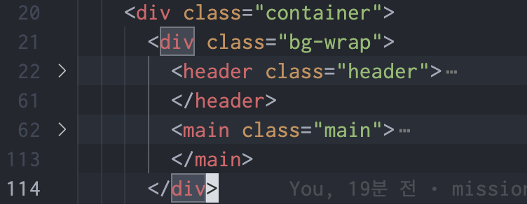
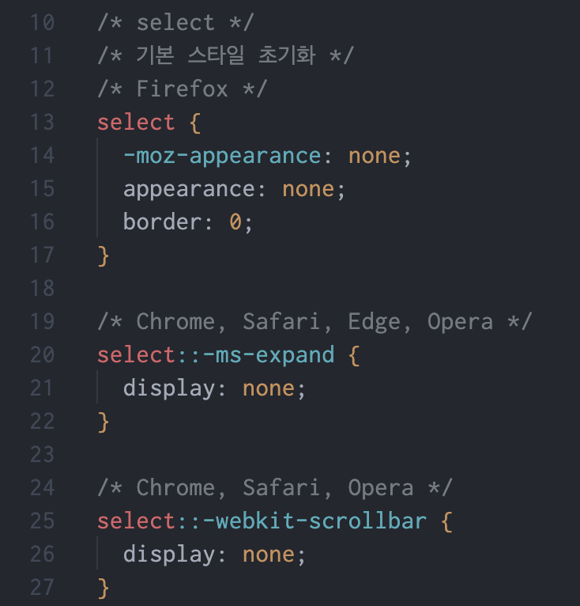
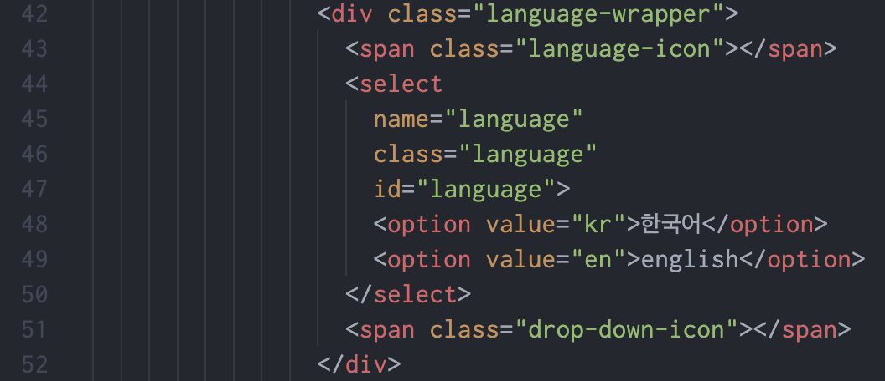
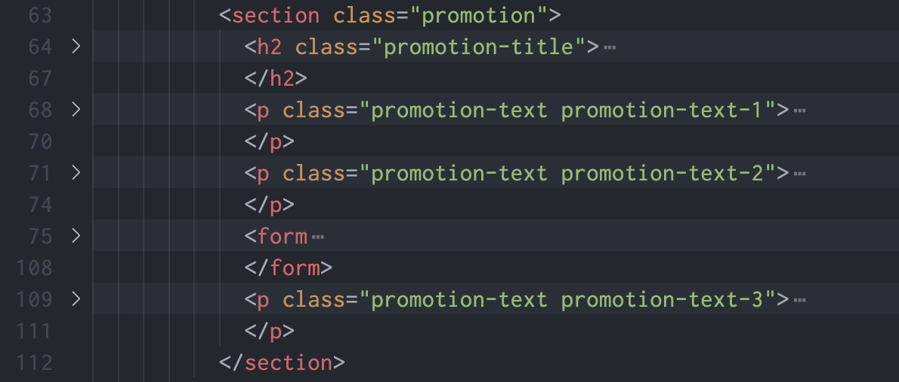
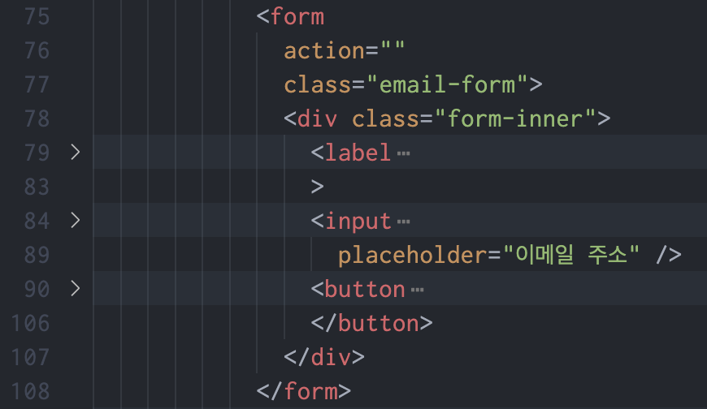
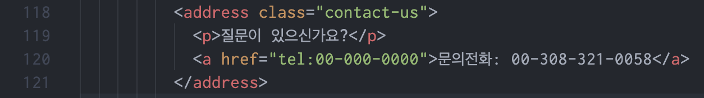
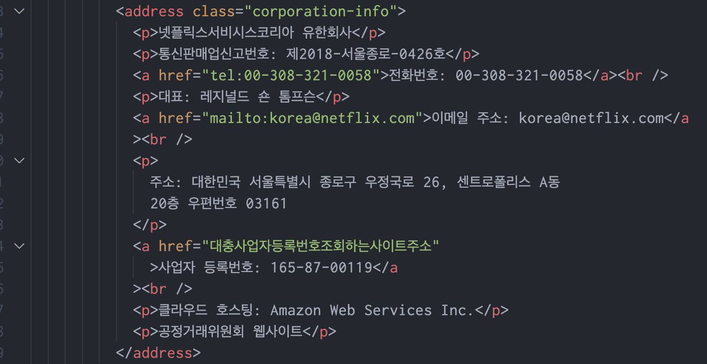

# Mission - 03

## 중점 사항

- 접근성과 사용성 측면을 고려하여 마크업 해보자.
- 컴포넌트 형식으로 재사용성을 높여보자.

### 레이아웃

> mission-03.html로 접속하면 로고 페이드아웃 애니메이션이 실행되고 pages/home/index.html 페이지로 이동.
> 크게 header, main, footer로 구성.
> header와 main은 하나의 배경을 적용하고 위해 div태그로 묶어서 배경을 적용.

> header의 select 요소는 appearance 속성을 none으로 설정하여 브라우저의 기본 스타일을 제거.

> select 요소를 language-wrapper 요소로 감싸고 language-wrapper를 position: relative로 설정.
> language-icon 요소와 drop-down-icon 요소는 position: absolute로 설정하고 language-wrapper 내부 좌우에 위치하도록 설정.

> main 요소 내부에는 section 요소로 구성.
> section 내부에 promotion text 요소와 form 요소 위치.

> form 요소는 input:email 요소와 label 요소, button:submit 요소로 구성.
> label 요소는 sr-only 클래스를 부여하여 화면에 표시되지 않도록 설정.
> flex를 column으로 배치하여 input 요소와 button 요소를 세로로 배치.

> footer 요소는 footer-inner 요소가 내부 요소들을 다 감싸고 있음.
> contact-us 요소의 전화번호는 클릭 시 전화 연결되도록 tel: 속성을 사용.

> footer-navigation 요소는 ul 요소를 감싸고 있고 ul 요소 내부 li요소 안에는 a 요소가 있음.
> footer-navigation 요소는 grid를 이용하여 모바일 화면에서는 2열, 데스크탑 화면에서는 4열로 배치.
> address.corporation-info 요소의 전화번호, 메일, 사업자등록번호는 클릭이나 터치 시 해당 링크로 이동되도록 a 요소로 감싸줌.

### 생각해볼 점

- header 와 main을 div 태그로 묶어서 배경을 적용하는 것이 좋은 방법인지?
- select 요소의 appearance 속성을 none으로 설정하여 브라우저의 기본 스타일을 제거하는 것이 좋은 방법인지?
- 작성한 코드의 접근성은 어떤지?
